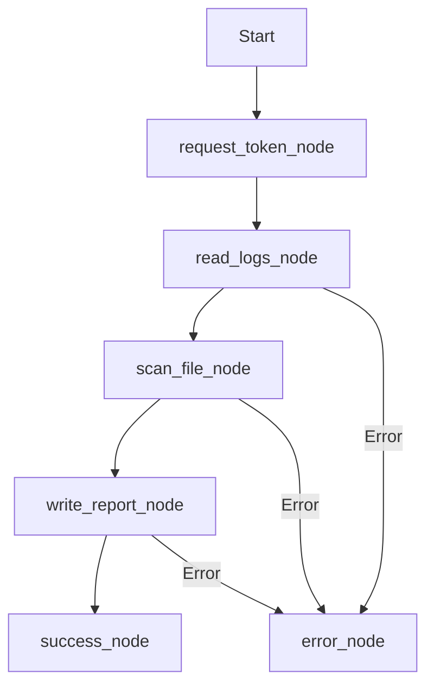
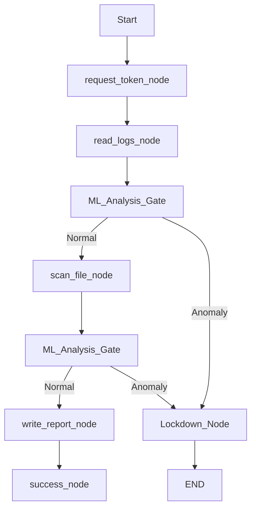

# Zero-Trust Non-Human Identity Framework for Agentic SOC
### Data Security and Privacy — DS308

A Zero-Trust security harness that lets AI agents autonomously investigate SOC alerts while preventing privilege escalation, prompt injection, and rogue behavior — enforced through cryptographic identity, policy engines, real-time token revocation, and ML anomaly detection.


---

## Table of Contents
- [What This Project Does](#what-this-project-does)
- [Architecture Overview](#architecture-overview)
- [The 4 Security Layers](#the-4-security-layers)
- [Phase Breakdown](#phase-breakdown)
- [Demo Walkthrough](#demo-walkthrough)
- [Setup & Installation](#setup--installation)
- [How to Run Each Phase](#how-to-run-each-phase)
- [Agent Flow Diagrams](#agent-flow-diagrams)
- [Zero-Trust Principles Applied](#zero-trust-principles-applied)
- [Key Design Decisions](#key-design-decisions)
- [Known Limitations & Future Work](#known-limitations--future-work)
- [Tech Stack Table](#tech-stack-table)
- [Team](#team)

---

## What This Project Does

In a modern Security Operations Center (SOC), AI agents are being deployed to handle high-volume alerts autonomously. However, these agents introduce a massive new attack surface: if an agent's prompt is injected or its logic is compromised, it could be used to execute malicious shell commands, dump sensitive logs, or pivot into internal infrastructure. 

This project solves that problem by surrounding the AI agent with a **Zero-Trust Security Harness**. Instead of trusting the agent's code, the system treats every tool call as potentially malicious. Before an agent can read a log or scan a file, its request must pass through four distinct security gates: cryptographic identity validation, real-time revocation checks, centralized policy enforcement (OPA), and ML-based behavioral analysis.

The result is a system where an attack is blocked in **under 500ms** without any human intervention. For example, if a compromised agent tries to use a legitimate tool like `read_logs` as part of an abnormal reconnaissance pattern (e.g., 15 calls in 2 seconds), the ML Behavioral Supervisor detects the anomaly and triggers an instant "Lockdown," revoking the agent's identity and halting the investigation before any data is exfiltrated.

---

## Architecture Overview

```text
                                    ┌───────────────────────┐
                                    │    Security Alert     │
                                    └───────────┬───────────┘
                                                │
                                    ┌───────────▼───────────┐
                                    │     Agent (LangGraph) │
                                    └───────────┬───────────┘
                                                │
                       ┌────────────────────────▼────────────────────────┐
                       │            1. Identity Check (JWT)              │
                       │   Presented by Agent -> Signed by RSA Private   │
                       └────────────────────────┬────────────────────────┘
                                                │
                       ┌────────────────────────▼────────────────────────┐
                       │           2. Revocation Check (Redis)           │
                       │   Is this specific Token ID (JTI) revoked?      │
                       └────────────────────────┬────────────────────────┘
                                                │
                       ┌────────────────────────▼────────────────────────┐
                       │          3. Policy Check (OPA-Rego)             │
                       │   Does Central Policy ALLOW this tool call?     │
                       └────────────────────────┬────────────────────────┘
                                                │
                       ┌────────────────────────▼────────────────────────┐
                       │      4. Behavioral Check (ML Supervisor)        │
                       │   Does call match normal session patterns?      │
                       └───────────┬────────────────────────┬────────────┘
                                   │                        │
                       ┌───────────▼───────────┐    ┌───────▼────────────┐
                       │     Tool Executes     │    │  Lockdown Trigger  │
                       │ (read_logs, VT_scan)  │    │ (Revoke & Quarantine)│
                       └───────────────────────┘    └────────────────────┘
```

---

## The 4 Security Layers

| Layer | Technology | What It Checks | What It Blocks | Response Time |
| :--- | :--- | :--- | :--- | :--- |
| **1. Cryptographic ID** | RS256 JWT | Signature & Expiry | Expired/Forged Tokens | < 10ms |
| **2. Real-time Revocation** | Redis | JTI Status | Replay attacks / Killed sessions | < 5ms |
| **3. Policy Engine** | OPA (Rego) | RBAC & Tool Scopes | Unauthorized Tool Calls | < 50ms |
| **4. ML Supervisor** | Isolation Forest | Sequence & Timing | Prompt Injection / Rogue Behavior | < 100ms |

---

## Phase Breakdown

### Phase 1: Secure Foundation 🛡️
Builds the core investigation logic and the first layer of cryptographic defense.
- **Key Deliverables**: LangGraph agent workflow, JWT Provider (RS256), `@requires_auth` decorator, and investigation tools.
- **The "Wow" Moment**: Attempting to call a tool directly without a token results in an immediate `UnauthorizedToolCallError` before a single line of tool logic runs.
- **Run Command**: `python phase1_soc/main.py`

### Phase 2: Zero-Trust & Auto-Response ⛓️
Introduces centralized policy and the "Fail-Closed" infrastructure.
- **Key Deliverables**: Redis revocation store, OPA REST integration, `soc_policy.rego`, and the Lockdown Engine.
- **The "Wow" Moment**: Running `malicious_agent.py` and seeing the terminal erupt into a `[LOCKDOWN] TRIGGERED` alert as OPA blocks an unauthorized `exec_shell` call.
- **Run Command**: `python phase2_soc/demo.py`

### Phase 3: LLM Intelligence 🧠
Upgrades the agent's reasoning capabilities using advanced LLMs and high-speed inference.
- **Key Deliverables**: Groq Llama 3.3 integration, LLM-based entity extraction, and Senior Analyst synthesis.
- **The "Wow" Moment**: Providing a "messy" natural language alert that contains no structured fields, yet the agent correctly identifies the IP and suspicious file through reasoning.
- **Run Command**: `python phase3_soc/main.py`

### Phase 4: ML Behavioral Supervisor 🤖
Moves security from static rules (Gate 3) to dynamic behavioral analysis (Gate 4).
- **Key Deliverables**: Telemetry collector, Feature Engineering engine, and Isolation Forest training/inference pipeline.
- **The "Wow" Moment**: A "Smart Attacker" uses only tools they are *allowed* to use, but gets caught and quarantined because their *behavioral pattern* deviates from the baseline.
- **Run Command**: `python phase4_soc/demo_phase4.py`

---

## Demo Walkthrough

### Scenario A: Normal Agent Path
1. Agent receives an alert for IP `192.168.1.45`.
2. Agent requests a token; Identity Provider issues a JWT signed with RS256.
3. Every tool call (`read_logs`, `virustotal_scan`) is checked against Redis and OPA.
4. ML Supervisor monitors the timing and order of calls, finding them "Normal".
5. Investigation completes; final report is saved to `incident_report.json`.

### Scenario B: Smart Attacker (ML Detection)
1. Agent-666 receives an alert but is actually being controlled by a prompt injection.
2. The attacker avoids using unauthorized tools like `exec_shell` to bypass OPA.
3. Instead, the attacker runs `read_logs` 15 times repeatedly to scrape data.
4. **ML Supervisor** detects the abnormal frequency and tool sequence.
5. Gate 4 fails; Lockdown is triggered; Token is revoked in Redis; Agent reaches `blocked_node`.

---

## Setup & Installation

### Prerequisites
- **Python 3.12+**
- **Docker Desktop** (for Redis and OPA)
- **Groq API Key** (from [console.groq.com](https://console.groq.com))

### Installation Steps
1. **Clone the Repo**
   ```bash
   git clone https://github.com/shreyas7ss/ZTF.git
   cd ZTF
   ```
2. **Setup Environment**
   ```bash
   python -m venv venv
   source venv/bin/activate  # venv\Scripts\activate on Windows
   pip install -r requirements.txt
   ```
3. **Configure API Keys**
   Create a `.env` file in the root:
   ```env
   GROK_API_KEY=your_groq_key_here
   ```
4. **Start Security Infrastructure**
   ```bash
   docker run -d -p 6379:6379 --name redis-soc redis
   docker run -d -p 8181:8181 --name opa-soc openpolicyagent/opa run --server --addr :8181
   ```
5. **Initialize Policy & Model**
   ```bash
   python phase4_soc/policies/upload_policy.py
   python phase4_soc/train_model.py
   ```

---

## How to Run Each Phase

| Phase | Command | Expected Output | Created Files |
| :--- | :--- | :--- | :--- |
| **1** | `python phase1_soc/main.py` | CLI investigation logs | `incident_report.json` |
| **2** | `python phase2_soc/demo.py` | Lockdown terminal alerts | `lockdown_log.json` |
| **3** | `python phase3_soc/main.py` | LLM reasoning logs | `incident_report.json` |
| **4** | `python phase4_soc/demo_phase4.py` | ML Anomaly detections | `telemetry_log.jsonl` |

---

## Agent Flow Diagrams

### Phase 1 Workflow (Linear Logic)


### Phase 4 Workflow (ML Supervised)


---

## Zero-Trust Principles Applied

| Principle | Implementation in Project |
| :--- | :--- |
| **Continuous Verification** | Every tool call must pass through 4 gates on every execution. |
| **Least Privilege** | Tokens are scoped to specific tools; OPA denies any tool not in the allowlist. |
| **Assume Breach** | The system assumes the agent is compromised and uses ML to detect behavioral drift. |
| **Stateless Identity** | Uses JWT for identity, verified cryptographically at the tool edge. |

---

## Key Design Decisions

- **RS256 over HS256**: Used asymmetric signing so the tools can verify tokens using a public key without ever having access to the private signing key.
- **OPA over If/Else**: Decoupling logic from security. Security policies can be updated via OPA without redeploying the agent code.
- **Isolation Forest for ML**: Ideal for anomaly detection in security logs where normal data is abundant but attacks (anomalies) are rare and unpredictable.
- **Fail-Closed on Unreachable**: If Redis or OPA are offline, the agent grants ZERO access. Security > Availability.

---

## Known Limitations & Future Work

1. **Ephemeral Keys**: RSA keys are currently generated in-process. *Future: Use AWS KMS or HashiCorp Vault.*
2. **Limited Feature Set**: ML behavioral analysis currently uses only 10 features. *Future: Add sequence length and entropy checks.*
3. **Mock Data Only**: The agent doesn't talk to a real SIEM. *Future: Splunk/Sentinel integration.*
4. **Single-Agent Scope**: The system handles one agent at a time. *Future: Multi-agent swarm orchestration.*
5. **No Human Review**: Lockdown is fully autonomous. *Future: Slack/Discord human approval gates.*

---

## Tech Stack Table

| Layer | Technology | Purpose |
| :--- | :--- | :--- |
| **Graph Context** | LangGraph | Stateful workflow and node management |
| **Identity** | PyJWT / Cryptography | RS256 token issuance and validation |
| **Gate 2** | Redis | Real-time token/agent revocation |
| **Gate 3** | OPA | Rego-based external policy enforcement |
| **LLM Inference** | Groq / Llama 3.3 | High-speed security reasoning |
| **ML Engine** | scikit-learn | Isolation Forest for behavioral analysis |

---

## Team
- **Course**: Data Security and Privacy — DS308
- **Project**: Zero-Trust Non-Human Identity Framework for Agentic SOC

---
*This project is submitted as the final capstone for DS308.*
